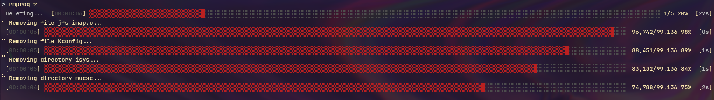

# rmprog



## Syntax

### **WARNING: If `PATH` is a symlink to a directory, it will delete the linked directory's contents! It will not follow symlinks inside the directories being deleted or symlinks to files.**

```bash
rmprog [-v] <PATH>...
```

It will work on both files and directories, with progress bar obviously being only visible on the latter. `-v` will print out every deleted file much like `rm -v`.

## Installation

Provided you have cargo and have .cargo/bin in $PATH:

```bash
cargo install --git https://github.com/Commensalism1997/rmprog.git
```

Async ver. (EXPERIMENTAL):
```bash
cargo install --git https://github.com/Commensalism1997/rmprog.git --branch async
```
